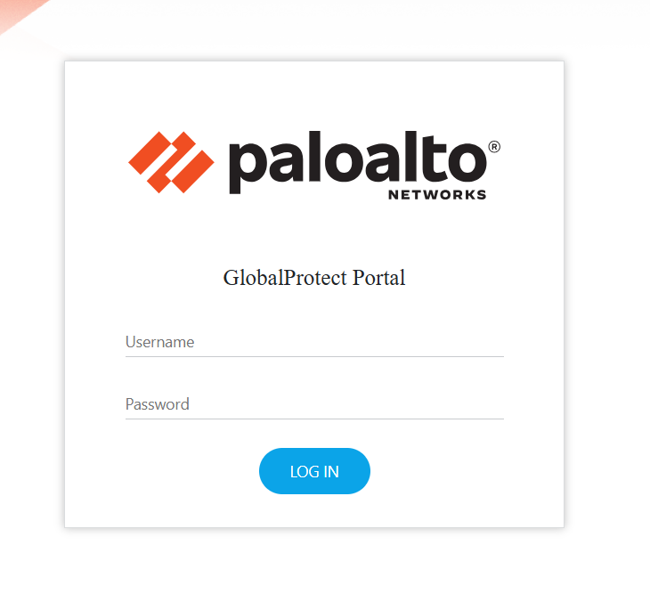
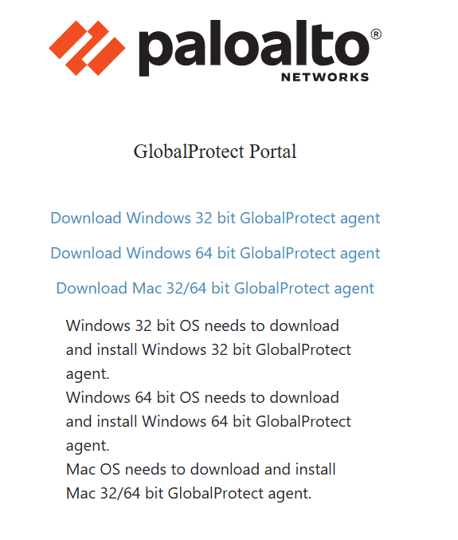
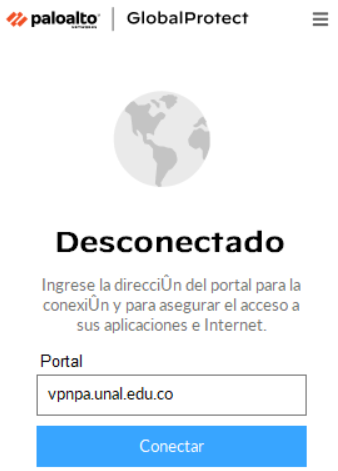
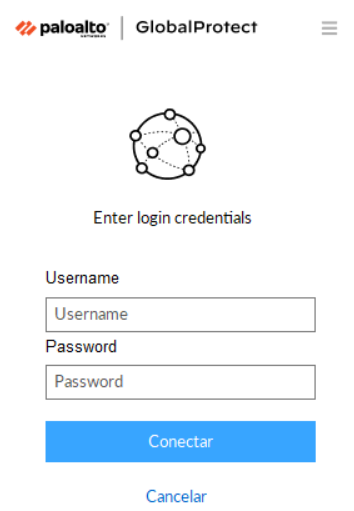
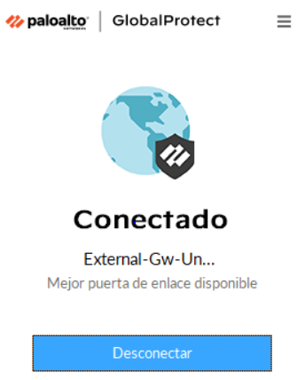

# Tutorial de conexión al HPC de la Facultad de Ingeniería desde Windows

Esta guía explica cómo conectarse al HPC desde Windows usando GlobalProtect para la VPN institucional y OpenSSH para el acceso por llave RSA.

El acceso al VPN y al HPC depende de una aprobación previa de los administradores. Primero debe generar su llave pública, enviarla con sus datos mediante el formulario y esperar una respuesta favorable antes de intentar conectarse.

## Objetivos

- Generar una llave SSH RSA de 4096 bits.
- Enviar la llave pública al formulario institucional y esperar aprobación.
- Instalar y usar GlobalProtect.
- Conectarse a la VPN institucional.
- Configurar OpenSSH en Windows.
- Conectarse al HPC mediante SSH.

## Requisitos previos

- Cuenta activa de la Universidad Nacional.
- Windows 10 o Windows 11.
- Conexión a Internet.

## Arquitectura de conexión

```text
Internet
  |
  v
vpnpa.unal.edu.co
  |
  v
GlobalProtect VPN
  |
  v
Red interna de la Universidad
  |
  v
HPC
```

## Paso 1: Crear la llave SSH

Genere una llave RSA de 4096 bits:

```powershell
ssh-keygen -t rsa -b 4096
```

Presione Enter para guardar la llave en la ubicación predeterminada:

```text
C:\Users\NombreUsuario\.ssh\
```

Cuando el sistema solicite una passphrase, puede dejarla vacía o definir una contraseña segura.

Se crearán dos archivos:

```text
id_rsa
id_rsa.pub
```

- `id_rsa`: llave privada, no se comparte.
- `id_rsa.pub`: llave pública, se envía al administrador del HPC.

## Paso 2: Enviar la llave pública y esperar aprobación

Envíe el archivo `id_rsa.pub` desde la carpeta:

```text
C:\Users\NombreUsuario\.ssh\
```

al formulario de acceso al HPC:

[Formulario de acceso](https://docs.google.com/forms/d/e/1FAIpQLSesV0MxEX2LuW0-qb3do4K5E4pAYCZPuE7c8N2kmcX-bvVP2Q/viewform?usp=header)

Complete los datos solicitados y adjunte la llave pública.

Hasta recibir una respuesta favorable, no intente conectarse a la VPN ni al HPC.

## Paso 3: Descargar GlobalProtect

Cuando ya tenga la aprobación, abra un navegador e ingrese a [vpnpa.unal.edu.co](https://vpnpa.unal.edu.co).

Inicie sesión con sus credenciales institucionales y descargue el instalador de GlobalProtect para Windows.





## Paso 4: Instalar GlobalProtect

Ejecute el archivo descargado y siga el asistente de instalación.

No es necesario cambiar la configuración predeterminada.

## Paso 5: Abrir GlobalProtect

Abra GlobalProtect desde el menú Inicio.

En el campo **Portal** escriba:

```text
vpnpa.unal.edu.co
```

Seleccione **Conectar**.



## Paso 6: Iniciar sesión

Ingrese su usuario y contraseña institucionales cuando aparezca la ventana de autenticación.



## Paso 7: Verificar la conexión VPN

Si la autenticación fue exitosa, el estado de GlobalProtect debe mostrar **Conectado**.



## Paso 8: Verificar OpenSSH

Abra PowerShell como administrador y ejecute:

```powershell
ssh -V
```

Debe aparecer una salida similar a esta:

```text
OpenSSH_for_Windows_9.x
```

## Paso 9: Crear el archivo de configuración SSH

En la carpeta `C:\Users\NombreUsuario\.ssh\`, cree un archivo llamado exactamente `config`.

Puede abrirlo con:

```powershell
notepad $env:USERPROFILE\.ssh\config
```

Agregue este contenido:

```text
Host clusterFacIngUN
    HostName 168.176.27.104
    User SU_USUARIO_HPC
    Port 22
    IdentityFile ~/.ssh/id_rsa
    IdentitiesOnly yes
```

Reemplace `SU_USUARIO_HPC` por su usuario institucional.

## Paso 10: Verificar el archivo config

Ejecute:

```powershell
dir $env:USERPROFILE\.ssh
```

Debe ver al menos:

```text
config
id_rsa
id_rsa.pub
```

## Paso 11: Iniciar el servicio ssh-agent

Verifique el estado del servicio:

```powershell
Get-Service ssh-agent
```

Si está detenido, ejecútelo:

```powershell
Set-Service ssh-agent -StartupType Automatic
Start-Service ssh-agent
```

## Paso 12: Agregar la llave al agente SSH

Agregue la llave privada al agente:

```powershell
ssh-add $env:USERPROFILE\.ssh\id_rsa
```

Verifique que quedó cargada:

```powershell
ssh-add -l
```

## Paso 13: Conectarse al HPC

Si el archivo `config` está bien configurado, conecte con:

```powershell
ssh clusterFacIngUN
```

Si necesita compresión de la sesión para transferir grandes cantidades de datos, puede usar:

```powershell
ssh -CY clusterFacIngUN
```

La primera vez aparecerá un aviso de autenticidad del host. Responda `yes` para guardar la huella digital.

## Verificar la conexión

Una vez dentro del HPC, ejecute:

```bash
whoami
```

Debe mostrar su usuario del HPC.

## Cerrar la sesión

Para salir del HPC, ejecute:

```bash
exit
```

Después desconecte la VPN desde GlobalProtect.
